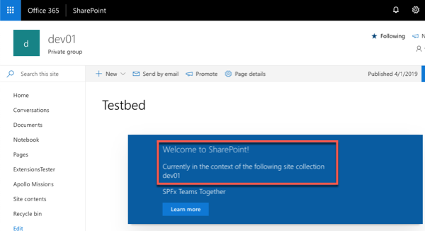
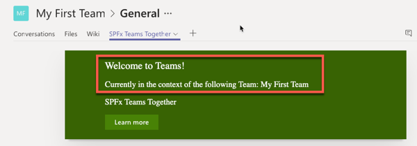

# Adding Conditional Logic for SharePoint or Microsoft Teams

In this demo, you will update the SharePoint Framework web part to display different information on the page depending if it is running within a SharePoint of Microsoft Teams context.

> This demo assumes you completed the previous demo. The final result from the previous demo is used as the starting point for this demo. The final results from the previous demo can be found here: [../01-spfxteams](../01-spfxteams).

1. Locate and open the file **./src/webparts/spFxTeamsTogether/SpFxTeamsTogetherWebPart.ts**.
1. Add the following `import` statement to the existing `import` statements at the top of the file:

    ```ts
    import * as microsoftTeams from '@microsoft/teams-js';
    ```

1. Add the following private member to the class `SpFxTeamsTogetherWebPart`. This will store the Microsoft Teams context in the case when the web part is running within a Microsoft Teams team:

    ```ts
    private teamsContext: microsoftTeams.Context;
    ```

1. Add the following method to the `SpFxTeamsTogetherWebPart` class to run when the web part is loaded on a page:

    ```ts
    protected onInit(): Promise<void> {
      return new Promise<void>((resolve, reject) => {
        if (this.context.microsoftTeams) {
          this.context.microsoftTeams.getContext(context => {
            this.teamsContext = context;
            resolve();
          });
        } else {
          resolve();
        }
      });
    }
    ```

1. Locate the `render()` method in the `SpFxTeamsTogetherWebPart` class. Add the following two members to set the title and current location depending if the web part is running in a SharePoint or Microsoft Teams context. Notice how using the necessary context property, you can get the name of the team or SharePoint site the web part is currently running within:

    ```ts
    let title: string = (this.teamsContext) 
      ? 'Teams'
      : 'SharePoint';
    let currentLocation: string = (this.teamsContext) 
      ? `Team: ${this.teamsContext.teamName}`
      : `site collection ${this.context.pageContext.web.title}`;
    ```

1. Lastly, update the HTML written to the page. Replace the existing `<div class="${ styles.column }">` with the following markup:

    > The only two parts that have changed are the title & subtitle.

    ```tsx
    <div class="${ styles.column }">
      <span class="${ styles.title }">Welcome to ${ title }!</span>
      <p class="${ styles.subTitle }">Currently in the context of the following ${ currentLocation }</p>
      <p class="${ styles.description }">${escape(this.properties.description)}</p>
      <a href="https://aka.ms/spfx" class="${ styles.button }">
        <span class="${ styles.label }">Learn more</span>
      </a>
    </div>
    ```

1. Rebuild, bundle, package and deploy the web part to see the results:
    1. Build the project by opening a command prompt and changing to the root folder of the project. Then execute the following command:

        ```shell
        gulp build
        ```

    1. Next, create a production bundle of the project by running the following command on the command line from the root of the project:

        ```shell
        gulp bundle --ship
        ```

    1. Finally, create a deployment package of the project by running the following command on the command line from the root of the project:

        ```shell
        gulp package-solution --ship
        ```

    1. Locate the file created by the gulp task, found in the **./sharepoint/solution** folder with the name ***.sppkg**.
    1. Drag this file into the **Apps for SharePoint** library in the browser. When prompted, select **Replace It**.

        

1. Test the changes.
    1. Navigate back to the SharePoint page where you added the web part in the previous demo.
    1. Notice how the page shows it is currently in the SharePoint context and displays the current SharePoint site name:

        

    1. Now go back into the Microsoft Teams team and select the tab that you previously added. Notice how the message says you are currently in Teams and the name of the team:

        