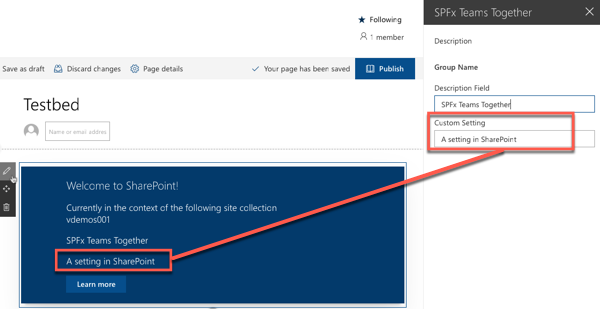
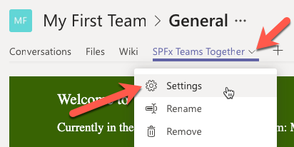
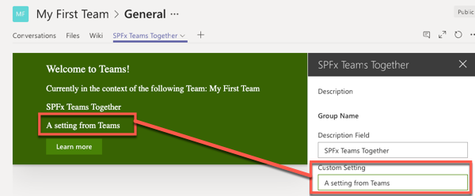
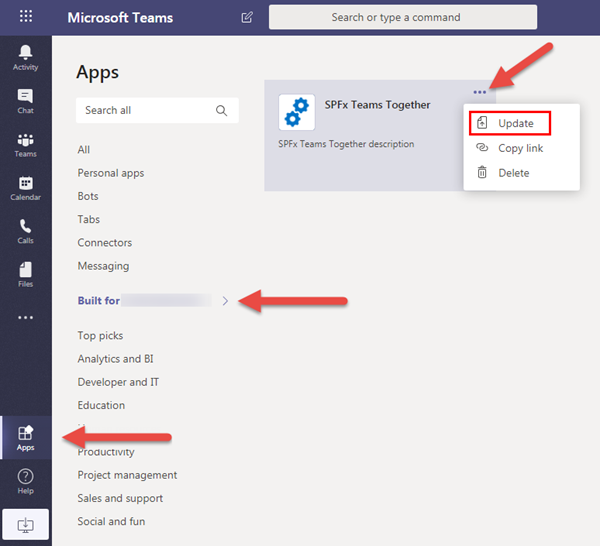
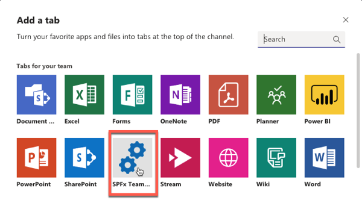
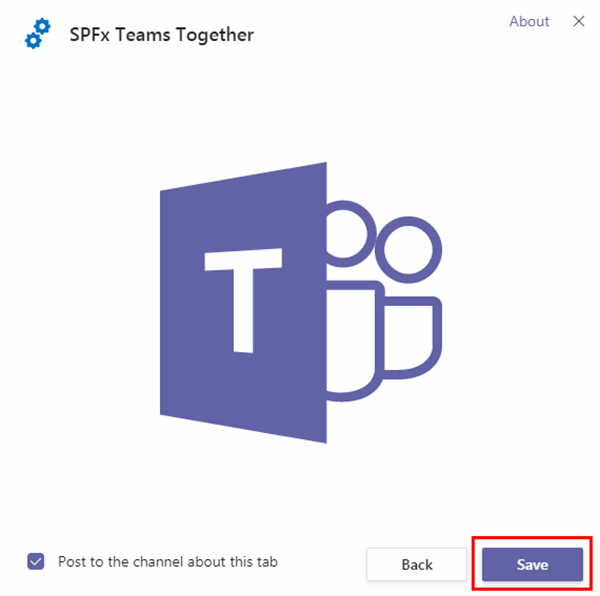
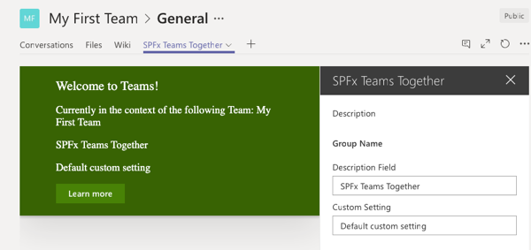
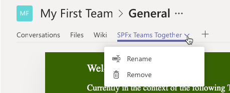

# Updating Configuration Settings

In this demo, you will update the configuration settings for the SharePoint Framework application, as well as update the configuration details of the Microsoft Teams application.

1. Add a new custom property to the web part:
    1. Locate and open the file **./src/webparts/spFxTeamsTogether/SpFxTeamsTogetherWebPart.ts**.
    1. Locate the interface `ISpFxTeamsTogetherWebPartProps`.
    1. Add a new property to the interface:

        ```ts
        customSetting: string;
        ```

    1. Locate the `render()` method within the `SpFxTeamsTogetherWebPart` class.
    1. Locate the following line in the `render()` method:

        ```tsx
        <p class="${ styles.description }">${escape(this.properties.description)}</p>
        ```

    1. Add the following TSX markup immediately following the previous line:

        ```tsx
        <p class="${ styles.description }">${escape(this.properties.customSetting)}</p>
        ```

    1. Scroll down to the `getPropertyPaneConfiguration()` method in the `SpFxTeamsTogetherWebPart` class.
    1. Locate the property pane field control for the existing **description** property:

        ```ts
        PropertyPaneTextField('description', {
          label: strings.DescriptionFieldLabel
        }),
        ```

    1. Add a comma after the existing `PropertyPaneTextField()` and the following code to give users a way to edit the setting:

        ```ts
        PropertyPaneTextField('customSetting', {
          label: 'Custom Setting'
        })
        ```

1. Add a default value for the new property:
    1. Locate and open the file **./src/webparts/spFxTeamsTogether/SpFxTeamsTogetherWebPart.manifest.json**
    1. Locate the `preconfiguredEntries[0].properties` object.
    1. Add the following property and value to the `properties` object:

        ```json
        "customSetting": "Default custom setting"
        ```

1. Rebuild, bundle, package and deploy the web part to see the results:
    1. Build the project by opening a command prompt and changing to the root folder of the project. Then execute the following command:

        ```shell
        gulp build
        ```

    1. Next, create a production bundle of the project by running the following command on the command line from the root of the project:

        ```shell
        gulp bundle --ship
        ```

    1. Finally, create a deployment package of the project by running the following command on the command line from the root of the project:

        ```shell
        gulp package-solution --ship
        ```

    1. Locate the file created by the gulp task, found in the **./sharepoint/solution** folder with the name ***.sppkg**.
    1. Drag this file into the **Apps for SharePoint** library in the browser. When prompted, select **Replace It**.

        

1. Test the changes.
    1. Navigate back to the SharePoint page where you added the web part in the previous demo.
    1. Edit the page and add a value to the new custom property you added. Notice how the page shows the value of the configuration setting:

        

    1. Now go back into the Microsoft Teams team. Select the down arrow to the right of the **SPFx Teams Together** tab and select **Settings**.

        

    1. Add a value to the **Custom Setting** property in the property pane. Notice how the tab shows the value of the configuration setting:

        

1. Update the Microsoft Teams application to disallow editing the configuration settings after the tab has been installed.
    1. Locate and open the following file in the project: **teams/manifest.json**.
    1. Set the value of the the property `version` to `0.2`.
    1. Locate the property `configurableTabs[0].canUpdateConfiguration`.
    1. Set the value of this property to `false` and save the file.
1. Recreate the Microsoft Teams app package by ZIP'ing the three files, **manifest.json** & two image files, into a new Microsoft Teams app package.
1. Delete the previous Microsoft Teams tab:
    1. Within the Microsoft Teams client, go to the **General** tab within the **My First Team**.
    1. Select the down-arrow to the right of the **SPFx Teams Together** tab and select **Remove**.
    1. When prompted, select **Remove**.
1. Update the previously installed Microsoft Teams app:
    1. Within the Microsoft Teams client, select **Store** in the lower right corner.
    1. Select the app menu, then select **Update**.

        

    1. Select the new Microsoft Teams app manifest.
1. Test the new Microsoft Teams app:
    1. Select the **My First Team** team previously created.
    1. Select the **General** channel.

        

    1. Add a custom tab to the team using the SPFx web part:
        1. At the top of the page, select the + icon in the horizontal navigation:

            

        1. In the **Add a tab** dialog, locate and select the **SPFx Teams Together** app:

            

        1. The next dialog will confirm the installation of the app. Select **Save**.

            

        1. The application should now load in Microsoft Teams within the **General** channel under the tab **SPFx Teams Together**.

            

        1. Notice how the web part's property pane opens by default. Edit the values of the public properties on the web part and then select the **X** in the upper-right corner of the property pane to close the initial configuration:

            

    1. Now go back into the Microsoft Teams team. Select the down arrow to the right of the **SPFx Teams Together** tab. Notice the **Settings** option is no longer present. This is because the setting in the Microsoft Teams app manifest specified the configuration can not be updated once it is installed into Microsoft Teams.

        
